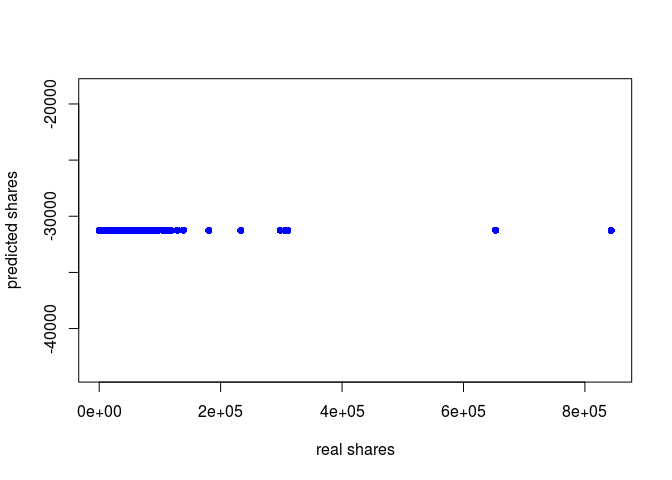

    # read the data
    setwd(dir ="~/datasets/OnlineNewsPopularity")
    newsdata=read.csv("train_70.0.csv")[,4:62]
    newsdata<-newsdata[complete.cases(newsdata),]
    newsdata<-na.omit(newsdata)

Outliers
--------

    # remove outliers

    out_index = c(2,3,4,5,6,7,8,9,18,19,20,21,23,25,26,27,28,29,59)
    # out_index = 59

    # individual plots, input index
    box_out <- function(x){
      boxplot(newsdata[,x], horizontal = T, names=x)  
    }

    #input names
    box_out_2 <- function(x){
      boxplot(newsdata[x], horizontal = T, names=x )  
    }

    # lapply(out_index, box_out)
    # lapply(names(newsdata)[out_index], box_out_2)

    rm_out <- function(x){
      outt = boxplot.stats(newsdata[,x])
      newsdata <<- subset(newsdata, newsdata[,x] <= outt[["stats"]][5])
    }

    # boxplot(newsdata[, out_index], horizontal = T)
    # lapply(out_index, rm_out)
    # boxplot(newsdata[, out_index], horizontal = T)
    # summary(newsdata)
    # hist(newsdata$shares)

Scaling
-------

    # min max normalisation
    maxs = apply(newsdata, 2, max)
    mins = apply(newsdata, 2 ,min)
    shares = as.numeric(newsdata$shares)
    trainNN <- as.data.frame(scale(newsdata, center = mins, scale = maxs - mins))
    # trainNN <- cbind(trainNN, shares)
    # scaled = cbind(trainNN[,3:61])
    head(trainNN)

    ##   n_tokens_title n_tokens_content n_unique_tokens n_non_stop_words
    ## 1      0.3333333       0.10354906    0.0007103712     0.0009596929
    ## 2      0.4761905       0.08670842    0.0007179286     0.0009596929
    ## 3      0.5714286       0.06861517    0.0008309340     0.0009596929
    ## 4      0.3809524       0.01753653    0.0011713812     0.0009596929
    ## 5      0.4285714       0.03312457    0.0008683247     0.0009596929
    ## 6      0.3333333       0.05441893    0.0007814602     0.0009596929
    ##   n_non_stop_unique_tokens  num_hrefs num_self_hrefs  num_imgs num_videos
    ## 1              0.001061008 0.02960526     0.00000000 0.0000000 0.01098901
    ## 2              0.001039390 0.01644737     0.03448276 0.0703125 0.00000000
    ## 3              0.001196581 0.02960526     0.00000000 0.0078125 0.00000000
    ## 4              0.001373626 0.01315789     0.02586207 0.0000000 0.01098901
    ## 5              0.001189307 0.01644737     0.02586207 0.0078125 0.00000000
    ## 6              0.001116965 0.02631579     0.02586207 0.0000000 0.01098901
    ##   average_token_length num_keywords data_channel_is_lifestyle
    ## 1            0.5803205    0.5555556                         0
    ## 2            0.5864417    0.6666667                         0
    ## 3            0.5804046    0.8888889                         0
    ## 4            0.6306544    0.3333333                         0
    ## 5            0.5914671    0.6666667                         0
    ## 6            0.5607079    0.7777778                         0
    ##   data_channel_is_entertainment data_channel_is_bus data_channel_is_socmed
    ## 1                             0                   0                      0
    ## 2                             0                   0                      0
    ## 3                             0                   1                      0
    ## 4                             1                   0                      0
    ## 5                             0                   1                      0
    ## 6                             0                   0                      0
    ##   data_channel_is_tech data_channel_is_world kw_min_min  kw_max_min
    ## 1                    1                     0 0.01322751 0.006367292
    ## 2                    1                     0 0.00000000 0.002399464
    ## 3                    0                     0 0.01322751 0.002359249
    ## 4                    0                     0 0.01322751 0.001404155
    ## 5                    0                     0 0.01322751 0.001749330
    ## 6                    1                     0 0.01322751 0.006702413
    ##    kw_avg_min  kw_min_max kw_max_max kw_avg_max   kw_min_avg kw_max_avg
    ## 1 0.014694847 0.002253053  0.8186885  0.1689592 0.5260041657 0.01468744
    ## 2 0.006263132 0.000000000  1.0000000  0.2731954 0.0002766987 0.01151008
    ## 3 0.006181216 0.000000000  1.0000000  0.3019092 0.0002766987 0.01197403
    ## 4 0.004383442 0.012095340  0.8186885  0.2474801 0.3699166031 0.01118121
    ## 5 0.004891732 0.007233487  1.0000000  0.3389236 0.5230744151 0.01863782
    ## 6 0.010064407 0.002371635  1.0000000  0.2073995 0.5536740324 0.01684002
    ##   kw_avg_avg self_reference_min_shares self_reference_max_shares
    ## 1 0.08431373               0.000000000               0.000000000
    ## 2 0.05270989               0.001037080               0.002727381
    ## 3 0.06117986               0.000000000               0.000000000
    ## 4 0.06556265               0.002027810               0.001660145
    ## 5 0.09031601               0.002172654               0.002608799
    ## 6 0.08790659               0.004490151               0.123443614
    ##   self_reference_avg_sharess weekday_is_monday weekday_is_tuesday
    ## 1                0.000000000                 0                  0
    ## 2                0.002184241                 0                  0
    ## 3                0.000000000                 1                  0
    ## 4                0.002027810                 0                  1
    ## 5                0.002679606                 1                  0
    ## 6                0.077636153                 0                  0
    ##   weekday_is_wednesday weekday_is_thursday weekday_is_friday
    ## 1                    0                   1                 0
    ## 2                    0                   1                 0
    ## 3                    0                   0                 0
    ## 4                    0                   0                 0
    ## 5                    0                   0                 0
    ## 6                    0                   0                 0
    ##   weekday_is_saturday weekday_is_sunday is_weekend     LDA_00     LDA_01
    ## 1                   0                 0          0 0.03595933 0.03695733
    ## 2                   0                 0          0 0.03082529 0.03086153
    ## 3                   0                 0          0 0.63906634 0.02400176
    ## 4                   0                 0          0 0.05394136 0.05639818
    ## 5                   0                 0          0 0.52802437 0.03085997
    ## 6                   1                 0          1 0.02728358 0.02700665
    ##       LDA_02     LDA_03     LDA_04 global_subjectivity
    ## 1 0.03660786 0.03601639 0.93339092           0.5354720
    ## 2 0.03105890 0.49293778 0.49400849           0.4365915
    ## 3 0.36916591 0.02537338 0.02399542           0.4667273
    ## 4 0.05450877 0.86179423 0.05392636           0.3818182
    ## 5 0.03110325 0.03091626 0.45807230           0.4904762
    ## 6 0.19683208 0.02707001 0.80195122           0.4517857
    ##   global_sentiment_polarity global_rate_positive_words
    ## 1                 0.4720308                  0.2161079
    ## 2                 0.5360283                  0.3819595
    ## 3                 0.5631163                  0.1826353
    ## 4                 0.5112508                  0.2041706
    ## 5                 0.5627448                  0.2161806
    ## 6                 0.5193825                  0.1644852
    ##   global_rate_negative_words rate_positive_words rate_negative_words
    ## 1                 0.07994823           0.6944444           0.3055556
    ## 2                 0.07811664           0.8043478           0.1956522
    ## 3                 0.04387349           0.7777778           0.2222222
    ## 4                 0.04291593           0.8000000           0.2000000
    ## 5                 0.06816060           0.7272727           0.2727273
    ## 6                 0.04148906           0.7692308           0.2307692
    ##   avg_positive_polarity min_positive_polarity max_positive_polarity
    ## 1             0.4245212                   0.1                  0.80
    ## 2             0.3601626                   0.1                  1.00
    ## 3             0.4407468                   0.1                  1.00
    ## 4             0.5000000                   0.5                  0.50
    ## 5             0.4625000                   0.1                  0.80
    ## 6             0.3385714                   0.1                  0.75
    ##   avg_negative_polarity min_negative_polarity max_negative_polarity
    ## 1             0.7503788             0.4000000             0.9166667
    ## 2             0.7648148             0.3000000             0.9000000
    ## 3             0.6875000             0.5000000             0.8750000
    ## 4             0.5666667             0.5666667             0.5666667
    ## 5             0.6833333             0.5000000             0.9500000
    ## 6             0.8259259             0.8000000             0.8444444
    ##   title_subjectivity title_sentiment_polarity abs_title_subjectivity
    ## 1         0.90000000                0.9000000              0.8000000
    ## 2         0.10000000                0.6000000              0.8000000
    ## 3         0.72727273                0.6590909              0.4545455
    ## 4         0.65000000                0.6750000              0.3000000
    ## 5         0.06666667                0.5000000              0.8666667
    ## 6         0.00000000                0.5000000              1.0000000
    ##   abs_title_sentiment_polarity      shares
    ## 1                    0.8000000 0.005502615
    ## 2                    0.2000000 0.002171208
    ## 3                    0.3181818 0.001409330
    ## 4                    0.3500000 0.002895427
    ## 5                    0.0000000 0.002316052
    ## 6                    0.0000000 0.004054177

    testNN = read.csv("test_30.0.csv")[,4:62]

    #fit
    features<-names(trainNN[,1:58])
    f <- paste(features,collapse = ' + ')
    f <- paste('shares ~', f)
    f <- as.formula(f)

Neural Network
--------------

    library(neuralnet)
    # nn <- neuralnet(f, trainNN, hidden=c(10,10), linear.output=T)
    # plot(nn)
    # predicted <- compute( nn, testNN[1:58])
    # predicted = (predicted$net.result * (max(newsdata$shares) - min(newsdata$shares))) + min(newsdata$shares)
    # plot(testNN$shares, predicted, col='blue', pch=16, ylab="predicted shares", xlab="real shares")

    # abline(0,1)

    # RMSE = (sum((testNN$shares - predicted)^2) / nrow(testNN)) ^ 0.5

RBF
---

    library("RSNNS")

    ## Loading required package: Rcpp

    rbfn <- RSNNS::rbf(trainNN[1:58], trainNN[59], size=50, linOut=TRUE)
    # summary(rbfn)
    rbf.predict = predict(rbfn, testNN[1:58])
    predicted_rbf = (rbf.predict * (max(newsdata$shares) - min(newsdata$shares))) + min(newsdata$shares)
    plot(testNN$shares, predicted_rbf, col='blue', pch=16, ylab="predicted shares", xlab="real shares")

