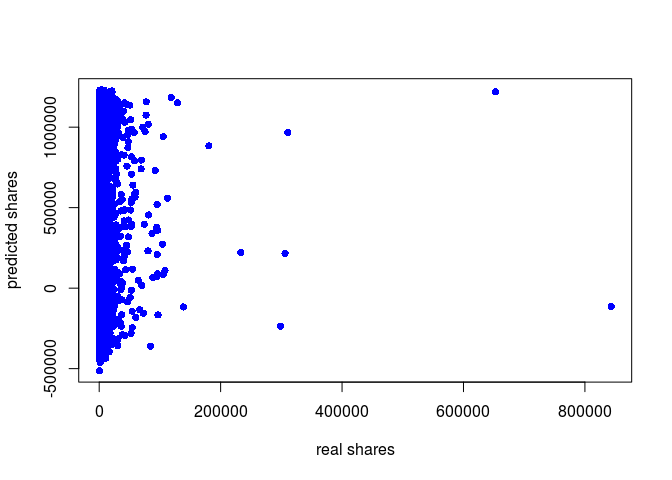

    # read the data
    setwd(dir ="~/datasets/OnlineNewsPopularity")
    newsdata=read.csv("NormalizedPCA.csv")[,2:22]
    newsdata<-newsdata[complete.cases(newsdata),]
    newsdata<-na.omit(newsdata)

Scaling
-------

    # min max normalisation
    maxs = apply(newsdata, 2, max)
    mins = apply(newsdata, 2 ,min)
    shares = as.numeric(newsdata$shares)
    trainNN <- as.data.frame(scale(newsdata, center = mins, scale = maxs - mins))
    # trainNN <- cbind(trainNN, shares)
    # scaled = cbind(trainNN[,3:61])
    head(trainNN)

    ##        shares       PC1       PC2       PC3       PC4       PC5        PC6
    ## 1 0.005502615 0.3833308 0.2936253 0.9983405 0.6076382 0.8660992 0.09853797
    ## 2 0.002171208 0.3532065 0.2239804 0.9974550 0.5931161 0.8977259 0.12364152
    ## 3 0.001409330 0.3764559 0.2291343 0.9978139 0.6056982 0.8756895 0.09445818
    ## 4 0.002895427 0.3724381 0.2494816 0.9978988 0.6343755 0.8669721 0.10897750
    ## 5 0.002316052 0.3755156 0.2537064 0.9977964 0.6204641 0.8797824 0.17789898
    ## 6 0.004054177 0.4239834 0.2115788 0.9977007 0.5888284 0.8945595 0.19938689
    ##         PC7       PC8       PC9      PC10      PC11      PC12      PC13
    ## 1 0.1447879 0.2666187 0.5003286 0.3385295 0.4382124 0.8803960 0.6621041
    ## 2 0.1262929 0.2474293 0.3913553 0.3874092 0.4036078 0.8585752 0.6446140
    ## 3 0.1369722 0.2463517 0.3982929 0.4677602 0.4104225 0.9096518 0.6391648
    ## 4 0.1154114 0.2462651 0.4730873 0.3765185 0.4304587 0.8574159 0.5951655
    ## 5 0.1289939 0.2416750 0.3986577 0.3921786 0.4066474 0.8937790 0.6319705
    ## 6 0.1428538 0.2702453 0.4123523 0.3955896 0.4762082 0.8664338 0.6476819
    ##        PC14      PC15      PC16      PC17      PC18      PC19      PC20
    ## 1 0.5616288 0.7023911 0.6530138 0.2969399 0.2680602 0.5861135 0.4974003
    ## 2 0.6135587 0.5955056 0.6640116 0.4265307 0.2790015 0.5713539 0.4073260
    ## 3 0.5642095 0.6650028 0.6106087 0.4144103 0.2846485 0.6641575 0.4156696
    ## 4 0.5437308 0.6892583 0.6623024 0.5042546 0.3044645 0.6984290 0.3768541
    ## 5 0.5644096 0.6052349 0.6411303 0.4523603 0.2989462 0.6782754 0.4352885
    ## 6 0.5682641 0.6388775 0.6207004 0.4449043 0.2811158 0.6270818 0.4780919

    testNN = read.csv("NormalizedPCA_test.csv")[,2:22]

    #fit
    features<-names(trainNN[,2:21])
    f <- paste(features,collapse = ' + ')
    f <- paste('shares ~', f)
    f <- as.formula(f)

Neural Network
--------------

    library(neuralnet)
    nn <- neuralnet(f, trainNN, hidden=c(10,10,10), linear.output=T)
    # plot(nn)
    predicted <- compute( nn, testNN[2:21])
    predicted = (predicted$net.result * (max(newsdata$shares) - min(newsdata$shares))) + min(newsdata$shares)
    plot(testNN$shares, predicted, col='blue', pch=16, ylab="predicted shares", xlab="real shares")

    # abline(0,1)

    RMSE = (sum((testNN$shares - predicted)^2) / nrow(testNN)) ^ 0.5

RBF
---

    library("RSNNS")

    ## Loading required package: Rcpp

    rbfn <- RSNNS::rbf(trainNN[2:21], trainNN[1], size=50, linOut=TRUE)
    # summary(rbfn)
    rbf.predict = predict(rbfn, testNN[2:21])
    predicted_rbf = (rbf.predict * (max(newsdata$shares) - min(newsdata$shares))) + min(newsdata$shares)
    plot(testNN$shares, predicted_rbf, col='blue', pch=16, ylab="predicted shares", xlab="real shares")

